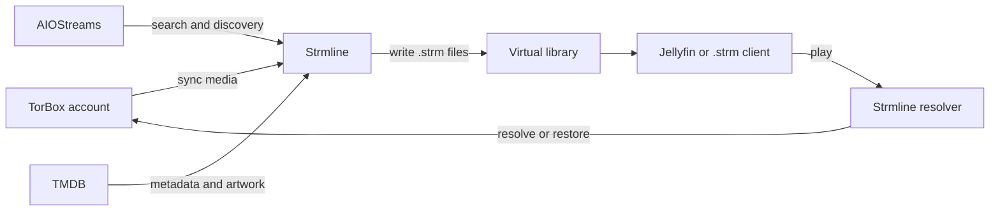

<h1 align="center">Strmline</h1>

<p align="center"><strong>Your TorBox library, structured and ready to stream.</strong></p>

<p align="center">
  Strmline turns TorBox media into a permanent virtual <code>.strm</code> library for Jellyfin and other compatible clients,<br>
  with built-in discovery, metadata, synchronization, and playback recovery.
</p>

<p align="center">
  <a href="https://github.com/Nepherius/Strmline/actions/workflows/publish-dockerhub.yml"></a>
  <a href="https://hub.docker.com/r/nepherius/strmline"></a>
  <a href="https://hub.docker.com/r/nepherius/strmline"></a>
  <a href="https://github.com/Nepherius/Strmline/stargazers"></a>
</p>

<p align="center">
  <a href="#quick-start">Quick start</a> ·
  <a href="#how-it-works">How it works</a> ·
  <a href="#permanent-virtual-library">Playback recovery</a> ·
  <a href="#development">Development</a>
</p>

---

## Features

- **Permanent virtual library** — removing a hash-backed torrent from TorBox does not remove its saved Strmline entry during the next sync.
- **Playback recovery** — resolver playback can re-add a cached torrent by info hash, match the original media file, and continue playback.
- **Search and add** — discover streams through AIOStreams, add a result to TorBox, and synchronize it into the library from one interface.
- **Organized output** — generate predictable movie, show, and anime folders that media servers can scan directly.
- **Metadata-aware matching** — use TMDB identities, titles, years, and artwork instead of relying only on filenames.
- **Library maintenance** — run manual or scheduled synchronization, classification overrides, metadata refreshes, and explicit removals.
- **Season completion** — optionally find released missing episodes through AIOStreams, preferring cached sources and respecting rate limits.
- **Safer `.strm` files** — resolver mode keeps final tokenized TorBox download URLs out of the generated library.
- **Self-hosted operations** — includes health checks, retained error logs, automatic database migrations, and an administrator password-reset command.

## How It Works



AIOStreams is the discovery layer; it does not sit in the normal playback path. Strmline stores the selected torrent identity, TorBox supplies the media, and the generated `.strm` file points back to Strmline's resolver.

## Permanent Virtual Library

For hash-backed torrents, Strmline snapshots the info hash and original file identity during synchronization. That makes the generated library independent from the current contents of the TorBox download list:

1. Jellyfin or another compatible client opens the stable Strmline URL stored in the `.strm` file.
2. Strmline first asks TorBox for a fresh playback URL using the current item and file IDs.
3. If the torrent was removed, Strmline looks it up by info hash and re-adds it with TorBox's cached-only option when necessary.
4. Strmline matches the original path, filename, and size, then redirects the player to a fresh TorBox URL.

Removing a torrent directly in TorBox therefore leaves the virtual library entry available. Explicitly removing it in Strmline clears its retention marker; TorBox deletion is best-effort and an already-absent torrent does not block local removal.

> [!NOTE]
> Playback recovery requires resolver mode, a stored torrent info hash, and content still available in the TorBox cache. Direct-play `.strm` files and older entries without a captured hash cannot use this fallback.

## Requirements

- Docker Engine with Docker Compose v2.
- A TorBox account and API key.
- A writable host directory for the generated library.
- A TMDB API key is optional but recommended for metadata, artwork, and reliable media matching.
- An AIOStreams base URL is optional and enables stream search and season auto-completion.

## Quick Start

1. Clone the repository and enter it.

   ```sh
   git clone https://github.com/Nepherius/Strmline.git
   cd Strmline
   ```

2. Create a directory for the generated media library.

   ```sh
   mkdir -p /mnt/strmline-library
   ```

3. Edit `docker-compose.yml` before starting the stack.

   - Replace both `CHANGE_ME` values with long, unique secrets.
   - Change `/mnt/strmline-library` if the library should live elsewhere.
   - Adjust the host port `45733` if it conflicts with another service.

   Generate a secret with:

   ```sh
   openssl rand -hex 32
   ```

4. Pull and start Strmline.

   ```sh
   docker compose pull
   docker compose up -d
   ```

5. Open `http://localhost:45733/setup` and complete the initial setup.

The setup page creates the first user and records the provider credentials. Configure TMDB for reliable matching and artwork, and AIOStreams if you want search and season completion. Database migrations run automatically during startup.

## Docker Compose Configurations

The repository provides a deployment compose file and a source-build development example:

| File                                      | Use case                             | Application image                           |
| ----------------------------------------- | ------------------------------------ | ------------------------------------------- |
| `docker-compose.yml`                      | Portainer or server deployment       | `nepherius/strmline:latest` from Docker Hub |
| `examples/docker-compose.development.yml` | Local source development and testing | Built from the local checkout               |

Both examples require the following changes before first use:

- Replace the application secret and PostgreSQL password placeholders.
- Change `/mnt/strmline-library` to the desired host library directory.
- Change `user: "1000:1000"` when the service should write files as a different host user and group.
- Change `45733` when the host port is already in use.

Strmline listens on container port `45733` by default. The compose examples publish it as `45733:45733`, which also avoids a collision with applications sharing a Gluetun network namespace that commonly use port `8080`.

Generate the two secret values with `openssl rand -hex 32` and keep them stable. Changing either value after PostgreSQL has initialized or after provider keys have been saved can make existing data inaccessible.

### Docker Hub and Portainer

The root `docker-compose.yml` is the Docker Hub deployment configuration. For Portainer, create a stack from that file, replace both secret placeholders, adjust the library mount, and deploy it.

It does not contain `build:`, so Portainer pulls `nepherius/strmline:latest` rather than building from a source checkout. To update an existing deployment manually:

```sh
docker compose pull
docker compose up -d
```

### Development

Run the source-build configuration from the repository root:

```sh
docker compose -f examples/docker-compose.development.yml up -d --build
```

The development file has `build.context: ..` because it is stored under `examples/`; this resolves to the repository root and uses the local `Dockerfile`. It uses the same Compose project name as deployment, so stop the deployment stack before starting the development stack.

The development configuration enables debug logging and exposes `/docs`, `/redoc`, and `/openapi.json`. These endpoints are disabled in the Docker Hub deployment configuration. Do not enable debug logging for routine production operation.

For repeatable server releases, replace the `latest` image tag in `docker-compose.yml` with a published version tag before deployment.

## Library Layout

The host library directory is mounted at `/library` inside the application container. Strmline manages the following top-level folders:

```text
library/
├── artwork/
├── movies/
├── shows/
└── anime/
```

Do not manually modify generated `.strm` files while a sync is running. Use the library interface to refresh metadata or remove generated entries.

## Playback Modes

Strmline defaults to resolver playback. Generated `.strm` files contain a stable Strmline URL, which keeps final tokenized TorBox URLs out of the library and enables playback recovery.

Direct playback is available as an explicit setup option for clients that cannot reach the resolver. It writes the final media URL into the `.strm` file, does not support recovery after TorBox removal, and should be treated as sensitive.

## Configuration

Most operational settings are available after login in the setup interface. Docker and database settings are configured in `docker-compose.yml` or through `STRMLINE_` environment variables.

| Setting                   | Purpose                                                                                                            |
| ------------------------- | ------------------------------------------------------------------------------------------------------------------ |
| `STRMLINE_APP_SECRET_KEY` | Required secret used to protect application state. Keep it stable after deployment.                                |
| `STRMLINE_DATABASE_URL`   | Full PostgreSQL connection URL. The compose configuration constructs this from the PostgreSQL settings by default. |
| `STRMLINE_LIBRARY_ROOT`   | Container path where the generated library is written. Defaults to `/library`.                                     |
| `STRMLINE_BASE_URL`       | Public Strmline URL used when resolver playback is selected.                                                       |
| `STRMLINE_SECURE_COOKIES` | Enable for HTTPS deployments.                                                                                      |
| `STRMLINE_DEBUG`          | Enables detailed application logging. Avoid using it routinely in production.                                      |

The setup interface also manages TorBox, TMDB, resolver, synchronization, category, and season auto-completion settings.

## Routine Operations

Pull and start the Docker Hub deployment:

```sh
docker compose pull
docker compose up -d
```

Follow application logs:

```sh
docker compose logs -f strmline
```

Stop the stack:

```sh
docker compose down
```

Update a source checkout while retaining the existing database and library:

```sh
git pull
docker compose -f examples/docker-compose.development.yml up -d --build
```

Keep the application secret and PostgreSQL password unchanged when updating an existing installation.

### Reset an Administrator Password

Run the administrative utility from the application container:

```sh
docker compose exec strmline python -m app.admin_cli reset-password
```

It prompts for a new password and prints the username that was reset. The command does not expose existing passwords or secrets.

## Season Auto-Completion

Season auto-completion is disabled by default. When enabled, Strmline checks shows already in the library, identifies released missing episodes, and searches configured AIOStreams sources.

The default behavior selects cached sources only. It can be configured to include uncached sources, but this may create downloads. The scheduler runs an initial check after enabling the setting, then runs at the configured day interval. Use the shows-per-minute setting to limit provider traffic and download activity on large libraries.

## Troubleshooting

### A `.strm` URL did not change after a rebuild

That is expected. Resolver URLs are stable library identifiers; Strmline refreshes the TorBox destination when the URL is played. Rebuilding the container does not require regenerating every `.strm` file.

### A `.strm` file ends with a newline

That is also expected. Strmline writes one URL followed by a single line-feed character, with no trailing space. Media servers ignore it. When testing manually, let the shell remove the newline:

```sh
mpv "$(tr -d '\r\n' < '/path/to/media.strm')"
```

Do not copy the newline into the `token` query parameter; an encoded `%0A` changes the token and produces a `403` response.

### Playback recovery fails

Confirm that resolver mode is enabled, the player can reach `STRMLINE_BASE_URL`, and the entry was synchronized with an info hash. Recovery deliberately uses TorBox's cached-only mode and will fail if the torrent is no longer cached.

## Development

The project has a FastAPI backend in `api/` and a SvelteKit frontend in `web/`.

Install backend dependencies in a virtual environment and run the backend checks:

```sh
cd api
python3 -m venv .venv
.venv/bin/pip install -e '.[dev]'
.venv/bin/python -m pytest
.venv/bin/python -m ruff check .
.venv/bin/python -m ruff format --check .
.venv/bin/python -m pyright
```

Install frontend dependencies and run its checks:

```sh
cd web
npm ci
npm run check
npm run lint
npm run test
```

Run the repository file-length check from the repository root:

```sh
python3 scripts/check_file_lengths.py
```

Or run the complete project check from the repository root:

```sh
make check
```
